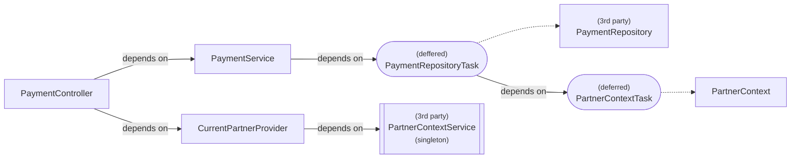

# Multi-tenant API example

In order to demonstrate the technique of "Async Injection at Runtime" described [here](../README.md), I developed a "multi-tenant" OpenApi Server.

* The only API's endpoint is `GetPayment(partnerName, paymentId)` which returns the corresponding "Payment" from the database of the given "partner".
* The API is "multi-tenant" because it could serve multiple (any) "partners" while a "Single-tenant" API could only provide a `GetPayment(paymentId)` for a specific "partner".

To implement the `GetPayment` endpoint, the server will have to

* Find the `PartnerContext` from the given `partnerName`, by calling an external `PartnerContextService`.
* Use the `databaseLocation` in the `PartnerContext` to make the database connection and retrieve the `Payment` with the given `paymentId`
* To enrich the example further, the API won't return the raw "Payment" from the database, but use a `PaymentService` to perform some Business logic before returning a "transformed version" of the payment.

Here is the over-simplified dependency graph we want to build


The `PaymentRepository` is responsible for database communication. It requires a `databaseLocation` which is found in the `PartnerContext`. This is the reason why the `PaymentRepository` depends on the `PartnerContext`.

The problem is that this `PartnerContext` can only be injected at runtime: When a request arrive, the `PaymentController` would parse the `partnerName` in the request then (asynchronously) retrieve the corresponding `PartnerContext` from an external `PartnerContextService`.

And yes, it is where I applied the pattern described in the [original article](../README.md) in order to (asynchronously) inject the `PartnerContext` at runtime:

## Step 1: Implement a `CurrentPartnerProvider`

(which is equivalent to the `IExecutionContextAsyncInjector` of the [original article](../README.md))

```C#
public interface ICurrentPartnerProvider
{
    void ProvidePartnerName(string partnerName);
    Task<PartnerContext> GetPartnerContextAsync();
}

public class CurrentPartnerProvider(IPartnerContextService _partnerContextService) : ICurrentPartnerProvider 
{
}
```

After parsing the request and find out the `partnerName`, the `PaymentController` would call `ProvidePartnerName(partnerName)` to register the `partnerName` to the "Service scope".

Another option is to store the `partnerName` as a part of the current `HttpContext` (the same way as Microsoft stored the UserName, JWT, Claims etc.. in the `HttpContext` and use these informations accross request handlings). This choice will make our `CurrentPartnerProvider` implementation tightly couple with the HTTP transport. But in some scenario it might be the only choice.

For now, it is fine to store the injected `partnerName` inside the `CurrentPartnerProvider` because the life time of this object is the same as the life time of the `HttpContext` in our case.

## Step 2: Use `Lazy<Task<PartnerContext>>`

Make the `PaymentRepository` depend on `Lazy<Task<PartnerContext>>`:

```C#
public class PaymentRepository(Lazy<Task<PartnerContext>> _deferredPartnerContextTask) : IPaymentRepository
{
}
```

with this, the DI framework should be able to resolve the `PaymentRepository` anytime. So it is safe to register it to our Dependency Graph

```C#
services.AddScoped<IPaymentRepository, PaymentRepository>();
```

## Step 3: Register the `Lazy<Task<PartnerContext>>`

With help of the `CurrentPartnerProvider` from the step 1, we can register the `Lazy<Task<PartnerContext>>` to the `ServiceCollection` as following:

```C#
services.AddScoped(serviceProvider
            => new Lazy<Task<PartnerContext>>(
                () => serviceProvider.GetRequiredService<ICurrentPartnerProvider>().GetPartnerContextAsync()
        ));
```

## But... the `PaymentRepository` implementation is not modifiable

To make things more challenging, let's suppose that the `PaymentRepository` had been implemented by other team and "black-boxed" in a library (nuget), so we couldn't make changes in the Step (2).

The black-boxed `PaymentRepository` implementation requires directly the `databaseLocation` string:

```C#
public class PaymentRepository(string databaseLocation) : IPaymentRepository
{
}
```

In this case we will have to "teach" the DI framework how to resolve this "3rd party" `PaymentRepository` object from a `Lazy<Task<PartnerContext>>`.

```C#
services.AddScoped(serviceProvider
                    => new Lazy<Task<IPaymentRepository>>(
                        async () =>
                        {
                            var deferredPartnerContextTask = serviceProvider.GetRequiredService<Lazy<Task<PartnerContext>>>();
                            var partnerContext = await deferredPartnerContextTask.Value;
                            return new PaymentRepository(partnerContext.DatabaseLocation);
                        }
                ));
```

As you can see, the DI framework can no longer resolve directly the `PaymentRepository` as before, it could only resolve a `Lazy<Task<PaymentRepository>>`.

And it is logical:

* if the `PaymentRepository` had depended on `Lazy<Task<PartnerContext>>`, then their life time would be separated. The DI framework can resolve a `PaymentRepository` anytime without worrying about the  existent of underlying `PartnerContext`, and it's safe to directly register the `PaymentRepository`.
* but in our case, the black-boxed `PaymentRepository` requires an existing `PartnerContext`. So the their life time are tightly coupled. We registered `Lazy<Task<PartnerContext>>` and so we have to do the same for the black-boxed `PaymentRepository`.

## Conclusion

Putting everything together, this is the final form of our Dependency Graph:



From now on:

* whenever you need the `PartnerContext` then you can inject the `Lazy<Task<PartnerContext>>`
* whenever you need the `PaymentRepository` then you can inject the `Lazy<Task<PaymentRepository>>`
